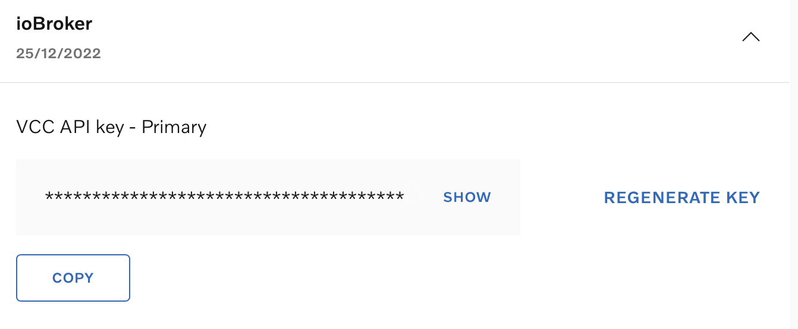

# ioBroker.volvo

## Volvo Cars Adapter for ioBroker

This adapter connects your Volvo car to ioBroker using the [Volvo Connected Vehicle API](https://developer.volvocars.com/apis/) and [Energy API v2](https://developer.volvocars.com/apis/energy/v2/overview/).

### Supported Features

- 🔋 Battery charge level, electric range, charging status (PHEV / BEV)
- ⛽ Fuel level, odometer, trip statistics
- 🚪 Door, window, and lock status
- 📍 GPS location
- 🔧 Diagnostics (service warnings, brake fluid, oil, tyres, lights)
- 🔑 Remote commands (lock/unlock, honk, flash, climatization)
- 🔄 Automatic data refresh at configurable intervals
- 🔐 Token persistence — survives adapter restarts without re-login

---

## Setup Guide

### 1. Get a VCC API Key

1. Go to [developer.volvocars.com](https://developer.volvocars.com/account/) and sign in (Google or GitHub account).
2. Create a new **Application**.
3. Copy the **VCC API Key (Primary)**.

### 2. Configure the Adapter

1. Open the adapter settings in ioBroker.
2. Enter your **Volvo ID email** and **password** (the same credentials you use in the Volvo Cars app).
3. Paste the **VCC API Key**.
4. Set the **update interval** (default: 5 minutes).

### 3. Login with OTP

The Volvo API uses a two-factor authentication flow with a one-time password (OTP):

1. Click **"Start Login (Send OTP)"** in the adapter settings.
2. Check your email for the OTP code from Volvo.
3. Enter the code and click **"Submit OTP"**.
4. The adapter will store the refresh token so you won't need to repeat this unless the token expires (typically weeks/months).

> **Note:** If the refresh token expires, the adapter will show a warning in the log. Simply repeat the OTP login from the adapter settings.

---

## Data Points

The adapter creates the following data point structure under `volvo.0.<VIN>`:

| Path | Description |
|---|---|
| `energy.batteryChargeLevel.*` | Battery charge level (%), updated timestamp |
| `energy.electricRange.*` | Electric driving range (km) |
| `energy.chargingStatus.*` | Charging status (IDLE, CHARGING, etc.) |
| `energy.chargerConnectionStatus.*` | Charger connection (CONNECTED, DISCONNECTED) |
| `status.doors.*` | Door states (OPEN/CLOSED), central lock |
| `status.windows.*` | Window states including sunroof |
| `status.fuel.*` | Fuel amount (liters) |
| `status.odometer.*` | Odometer reading (km) |
| `status.diagnostics.*` | Service warnings, distance/time to service |
| `status.statistics.*` | Fuel/energy consumption, trip meters |
| `status.engine-status.*` | Engine running state |
| `status.warnings.*` | Light warnings (brake lights, fog, indicators, etc.) |
| `location.*` | GPS coordinates, heading, timestamp |
| `remote.*` | Remote commands (buttons) |

## Remote Commands

Use the buttons under `volvo.0.<VIN>.remote` to control your vehicle:

- `lock` / `unlock` — Lock or unlock the car
- `climatization-start` / `climatization-stop` — Start or stop pre-conditioning
- `honk` / `flash` / `honk-and-flash` — Sound horn or flash lights
- `engine-start` / `engine-stop` — Remote engine start/stop

---

## Changelog

### 0.1.4

- Fixed Energy API v2 data parsing (batteryChargeLevel, electricRange, etc.)
- Removed obsolete `newApi` checkbox — adapter always uses the new Connected Vehicle API
- Cleaned up old stale data points from deprecated v1 API
- Admin UI fully localized (English + German)
- Updated README with new setup guide

### 0.1.3

- Fixed Energy API endpoint from v1 (`/energy/v1/vehicles/{vin}/recharge-status`, HTTP 410 GONE) to v2 (`/energy/v2/vehicles/{vin}/state`)

### 0.1.2

- Rewrote authentication: new multi-step OTP flow (old `grant_type: password` is dead)
- Added OTP login UI in adapter settings
- Added token persistence via ioBroker states (survives restarts)
- Updated vehicle list endpoint from `extended-vehicle/v1` (HTTP 410) to `connected-vehicle/v2`
- Fixed token refresh with correct headers
- Added `messagebox: true` for admin ↔ adapter communication

### 0.1.1

- Added location API information

### 0.1.0

- (TA2k) Add new API for electric cars

### 0.0.6

- (TA2k) Fix trip object naming

### 0.0.5

- (TA2k) Fix receiving data

### 0.0.4

- (TA2k) Fix jscontroller

### 0.0.3

- (TA2k) Fix preclimate

### 0.0.2

- (TA2k) Initial release

## License

MIT License

Copyright (c) 2020-2030 TA2k <tombox2020@gmail.com>

Permission is hereby granted, free of charge, to any person obtaining a copy
of this software and associated documentation files (the "Software"), to deal
in the Software without restriction, including without limitation the rights
to use, copy, modify, merge, publish, distribute, sublicense, and/or sell
copies of the Software, and to permit persons to whom the Software is
furnished to do so, subject to the following conditions:

The above copyright notice and this permission notice shall be included in all
copies or substantial portions of the Software.

THE SOFTWARE IS PROVIDED "AS IS", WITHOUT WARRANTY OF ANY KIND, EXPRESS OR
IMPLIED, INCLUDING BUT NOT LIMITED TO THE WARRANTIES OF MERCHANTABILITY,
FITNESS FOR A PARTICULAR PURPOSE AND NONINFRINGEMENT. IN NO EVENT SHALL THE
AUTHORS OR COPYRIGHT HOLDERS BE LIABLE FOR ANY CLAIM, DAMAGES OR OTHER
LIABILITY, WHETHER IN AN ACTION OF CONTRACT, TORT OR OTHERWISE, ARISING FROM,
OUT OF OR IN CONNECTION WITH THE SOFTWARE OR THE USE OR OTHER DEALINGS IN THE
SOFTWARE.
